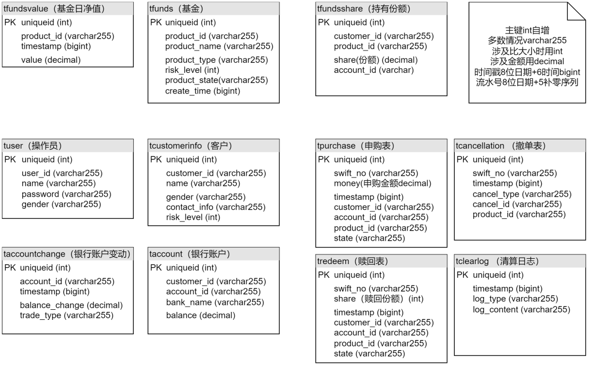

# 恒生理财销售交易系统

   本项目名称为理财销售交易系统，是一款为理财销售人员而设计简易平台。该平台涵盖基金管理、客户开户、基金申购与赎回、清算及业务查询等核心功能，以及风险等级校验、同卡进出要求和简易工作日管理等功能。

​    在技术架构方面，该系统采用了**前后端分离**的架构。前端基于恒生的**HUI框架**（HUI是一款基于VUE框架封装的轻量级纯前端组件库，专为PC界面的中后台产品设计），确保了用户界面的简洁性和易用性；后端使用了恒生的**JRESCloud框架**（ JRES是恒生自主研发的一款基于Java的、分布式微服务框架，专为复杂的企业级业务场景而设计），以提供强大的服务支持和高性能的数据处理。整个系统的数据库采用**MySQL**，这确保了数据管理的稳定性和高效性。通过这一架构，我们能够实现系统的高效开发和快速迭代，满足金融行业快速发展的需求。  

## 整体架构

### 业务架构

### 系统架构

1. 客户端发送url到GateWay中，通过GateWay路由校验后由GateWay请求转发到对应服务。

2. 服务通过Zookeeper进行注册，服务之间通过Dubbo集成Zookeeper通过RPC服务发现互相调用。

3. 服务中的查询操作先查询Redis缓存，Redis缓存中没有才会去查询Mysql数据库，设置了一主二从的Redis服务，通过三个哨兵对Redis监听。

## 功能需求分析

### 功能模块划分

### 业务使用流程

## 数据库设计

## 界面展示

